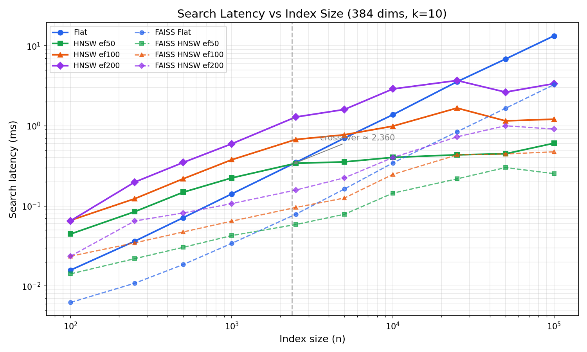
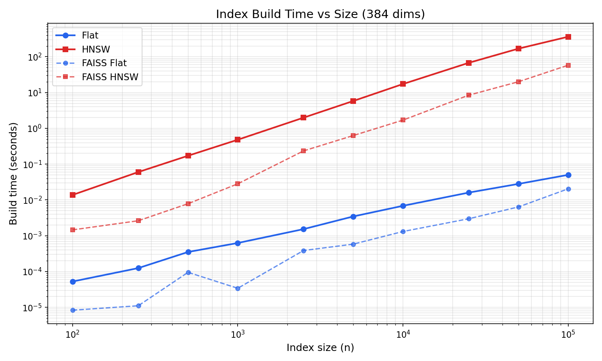

<p align="center">
  
</p>

# goformersearch

[](https://pkg.go.dev/github.com/MichaelAyles/goformersearch)
[](https://github.com/MichaelAyles/goformersearch/actions/workflows/ci.yml)

Pure Go vector similarity search. Brute-force and HNSW. No CGO. No native dependencies.

```go
import "github.com/MichaelAyles/goformersearch"

// Build an index
index := goformersearch.NewHNSWIndex(384)
for _, doc := range documents {
    index.Add(doc.ID, doc.Embedding)
}

// Search
results := index.Search(queryVec, 10)
for _, r := range results {
    fmt.Printf("ID: %d, similarity: %.4f\n", r.ID, r.Similarity)
}
```

## What This Is

A Go library that indexes float32 vectors and returns the k nearest neighbours by cosine similarity. Two index types: brute-force (exact) and HNSW (approximate). Designed to pair with [goformer](https://github.com/MichaelAyles/goformer) but works with any source of float32 vectors.

Reference workload: 10k-50k document chunks at 384 dimensions, tens of queries per second on a single core.

## Why

FAISS is the standard for vector search, but using it from Go requires CGO. chromem-go bundles embedding, storage, and persistence into one package — more surface area than you need if you just want an index. The pure Go ANN libraries (goannoy, gann) use different algorithms or are archived.

goformersearch does one thing: vectors in, neighbours out. It ships both exact and approximate search behind the same interface, with zero dependencies.

## API

```go
// Index is the interface implemented by all index types.
type Index interface {
    Add(id uint64, vec []float32)
    Search(query []float32, k int) []Result
    Len() int
    Dims() int
}

// Result holds a search result.
type Result struct {
    ID         uint64
    Similarity float32
}

// Brute-force: exact results, O(n) per query.
func NewFlatIndex(dims int) *FlatIndex

// HNSW: approximate results, O(log n) per query.
func NewHNSWIndex(dims int, opts ...HNSWOption) *HNSWIndex

// HNSW tuning options.
func WithM(m int) HNSWOption              // connections per node (default 16)
func WithEfConstruction(ef int) HNSWOption // build-time search width (default 200)
func WithEfSearch(ef int) HNSWOption       // query-time search width (default 50)

// Serialisation.
func Save(w io.Writer, idx Index) error
func LoadFlat(r io.Reader) (*FlatIndex, error)
func LoadHNSW(r io.Reader) (*HNSWIndex, error)
```

The `Index` interface is the key design decision. Code that doesn't care about exact vs approximate uses `Index`. Code that needs to tune HNSW parameters uses `*HNSWIndex` directly.

## Usage

### Flat index (exact search)

```go
index := goformersearch.NewFlatIndex(384)

// Add vectors
for id, vec := range vectors {
    index.Add(uint64(id), vec)
}

// Search — returns exact k nearest neighbours
results := index.Search(query, 10)
```

### HNSW index (approximate search)

```go
index := goformersearch.NewHNSWIndex(384,
    goformersearch.WithM(16),
    goformersearch.WithEfConstruction(200),
)

// Add vectors
for id, vec := range vectors {
    index.Add(uint64(id), vec)
}

// Tune search quality vs speed
index.SetEfSearch(100)

// Search — returns approximate k nearest neighbours
results := index.Search(query, 10)
```

### With goformer

```go
model, _ := goformer.Load("./bge-small-en-v1.5")

index := goformersearch.NewHNSWIndex(model.Dims())
for _, doc := range documents {
    vec, _ := model.Embed(doc.Text)
    index.Add(doc.ID, vec)
}

queryVec, _ := model.Embed("DMA channel configuration")
results := index.Search(queryVec, 10)
```

### Save and load

```go
// Save
f, _ := os.Create("index.bin")
goformersearch.Save(f, index)
f.Close()

// Load
f, _ = os.Open("index.bin")
index, _ := goformersearch.LoadHNSW(f)
f.Close()
```

## Benchmarks

All measurements at 384 dimensions, k=10, M=16, efConstruction=200. FAISS (C++, same parameters) shown for reference.

### Search Latency

<p align="center">
  
</p>

Brute-force wins below ~2,400 vectors. Past that, HNSW is faster and the gap widens with scale.

| Index size | Flat | HNSW ef=50 | FAISS Flat | FAISS HNSW ef=50 |
|---|---|---|---|---|
| 1k | 0.14ms | 0.25ms | 0.03ms | 0.04ms |
| 10k | 1.38ms | 0.41ms | 0.34ms | 0.14ms |
| 50k | 6.9ms | 0.47ms | 1.66ms | 0.30ms |
| 100k | 14ms | 0.59ms | 3.3ms | 0.25ms |

FAISS flat is ~4x faster (SIMD-optimized C++). For HNSW the gap narrows to ~2x — graph traversal dominates over the per-node dot product.

### Build Time

<p align="center">
  
</p>

| Index size | Flat | HNSW | FAISS Flat | FAISS HNSW |
|---|---|---|---|---|
| 10k | 7ms | 17s | 1ms | 1.7s |
| 50k | 28ms | 169s | 6ms | 20s |
| 100k | 50ms | 372s | 20ms | 58s |

### Tuning efSearch

Higher `efSearch` improves recall at the cost of latency:

| efSearch | Search latency (50k) |
|---|---|
| 50 | 0.47ms |
| 100 | 1.0ms |
| 200 | 2.7ms |

## Concurrency

Safe for concurrent reads (Search) once all writes (Add) are complete. Not safe for concurrent Add. This matches the expected pattern: build the index, then serve queries.

## Limitations

- **In-memory only.** No disk-backed indexes.
- **No deletion.** HNSW deletion is complex; rebuild the index instead.
- **No filtering.** This is a vector index, not a database.
- **Cosine similarity only.** Assumes L2-normalised input vectors.

## License

MIT
